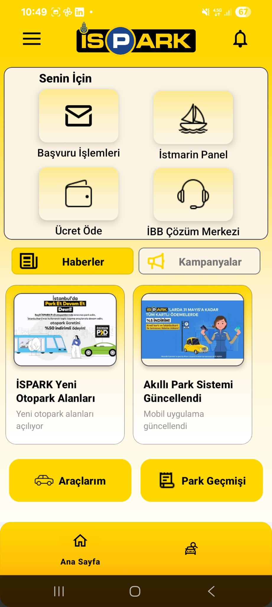
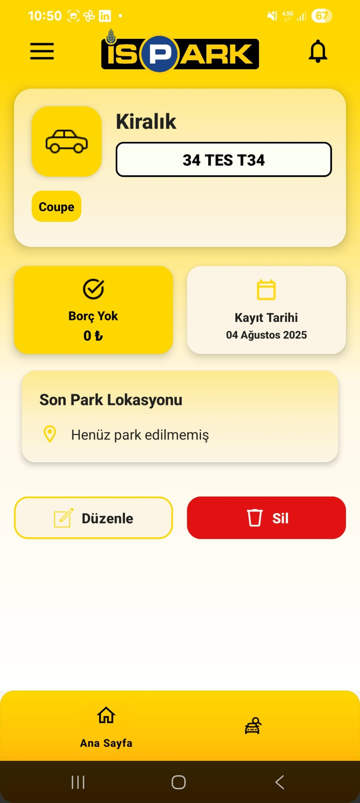
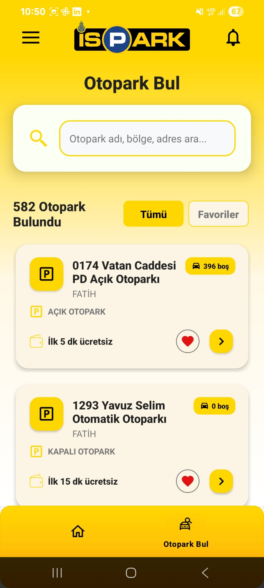
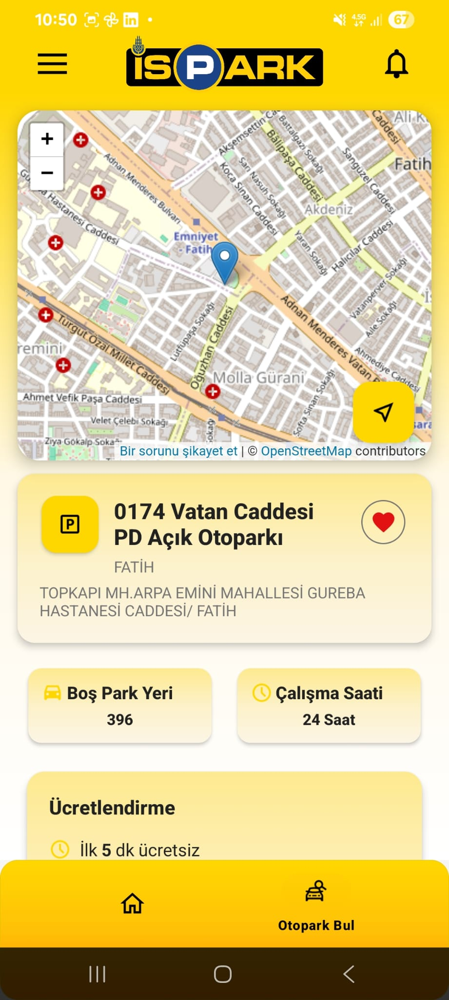
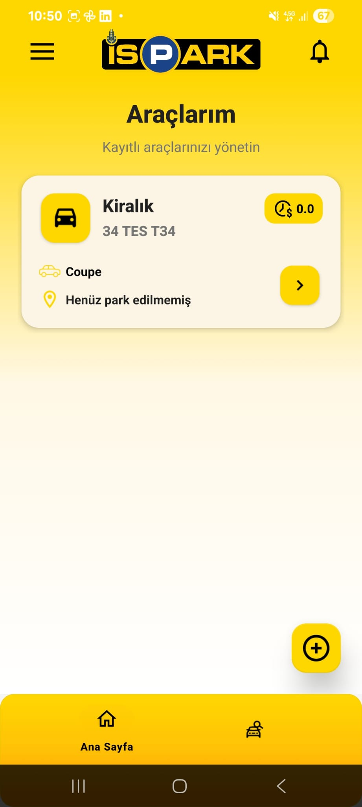
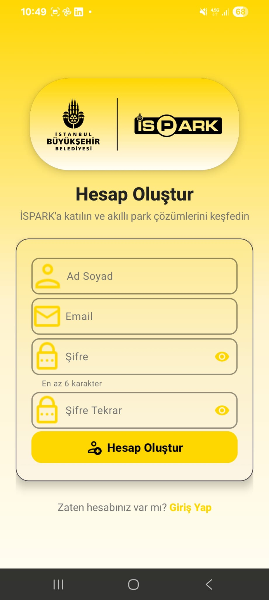
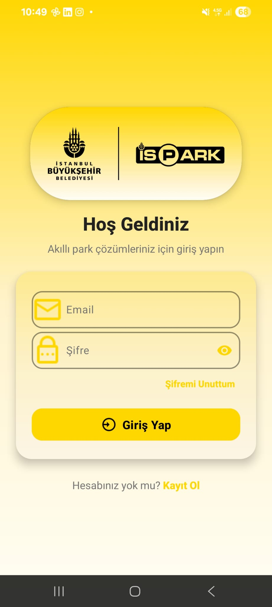
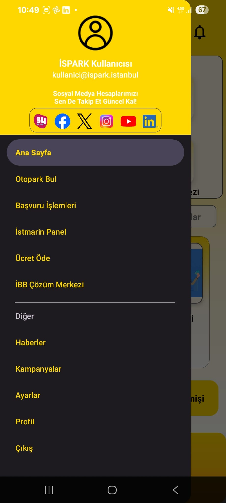
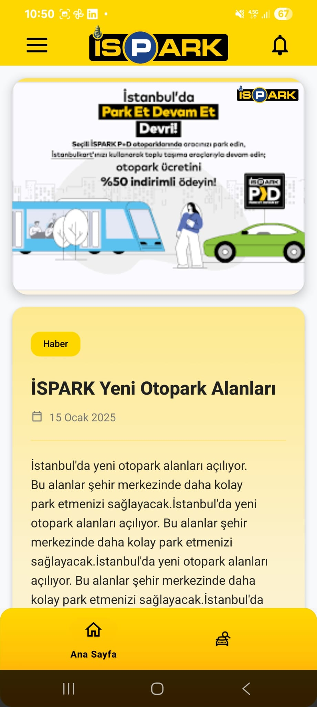

# 🚗 İSPARK - İstanbul Akıllı Park Uygulaması

<div align="center">
  
  <br>
  <h3>İstanbul'un resmi park uygulamasının modern klonu</h3>
  <p>Kotlin ve MVVM mimarisi ile geliştirilmiş Android uygulaması</p>
</div>

## 📱 Uygulama Ekran Görüntüleri

<div align="center">
  <table>
    <tr>
      <td align="center"><strong>Ana Sayfa</strong></td>
      <td align="center"><strong>Araç Ekleme</strong></td>
      <td align="center"><strong>Araç Yönetimi</strong></td>
    </tr>
    <tr>
      <td></td>
      <td></td>
      <td></td>
    </tr>
  </table>
  
  <table>
    <tr>
      <td align="center"><strong>Otopark Arama</strong></td>
      <td align="center"><strong>Harita Görünümü</strong></td>
      <td align="center"><strong>Otopark Detayları</strong></td>
    </tr>
    <tr>
      <td></td>
      <td></td>
      <td></td>
    </tr>
  </table>
  
  <table>
    <tr>
      <td align="center"><strong>Kayıt Ol</strong></td>
      <td align="center"><strong>Giriş Yap</strong></td>
      <td align="center"><strong>Menü</strong></td>
    </tr>
    <tr>
      <td></td>
      <td></td>
      <td></td>
    </tr>
  </table>
  
  <table>
    <tr>
      <td align="center"><strong>Haberler & Kampanyalar</strong></td>
    </tr>
    <tr>
      <td></td>
    </tr>
  </table>
</div>

## ✨ Özellikler

### 🚙 Araç Yönetimi
- **Araç Ekleme**: Plaka, araç adı ve tip bilgileriyle araç kaydetme
- **Araç Düzenleme**: Mevcut araç bilgilerini güncelleme
- **Araç Silme**: Kayıtlı araçları kaldırma
- **Borç Takibi**: Araç başına borç durumu görüntüleme

### 🅿️ Otopark Servisleri
- **Otopark Arama**: 582+ otopark arasında arama yapma
- **Harita Entegrasyonu**: Otoparkları harita üzerinde görüntüleme
- **Favori Otoparklar**: Sık kullanılan otoparkları favorilere ekleme
- **Gerçek Zamanlı Kapasite**: Boş park yeri sayısını görme
- **Çalışma Saatleri**: Otoparkların açık olduğu saatleri öğrenme
- **Ücretlendirme**: İlk 5 dk ücretsiz park imkanı

### 📰 İçerik & Bilgilendirme
- **Haberler**: İSPARK'tan güncel haberler
- **Kampanyalar**: Özel indirim ve kampanyalar
- **Sosyal Medya Entegrasyonu**: Tüm sosyal medya hesaplarına erişim

### 🔐 Kullanıcı Yönetimi
- **Firebase Auth**: Güvenli kullanıcı kimlik doğrulama
- **Kullanıcı Kayıt**: Email ve şifre ile hesap oluşturma
- **Giriş Yapma**: Mevcut hesapla oturum açma
- **Profil Yönetimi**: Kullanıcı bilgilerini düzenleme

## 🏗️ Teknik Mimari

### 📋 Teknolojiler
- **Kotlin**: Ana programlama dili
- **MVVM Pattern**: Model-View-ViewModel mimarisi
- **View Binding**: Güvenli view erişimi
- **Navigation Component**: Fragment yönetimi
- **Room Database**: Yerel veri saklama
- **Retrofit**: REST API işlemleri
- **Firebase**: Kimlik doğrulama servisi
- **Glide**: Görsel yükleme ve önbellekleme
- **Lottie**: Animasyonlar

### 🏛️ Mimari Bileşenler

```
app/
├── model/           # Veri modelleri
│   ├── Park.kt      # Otopark modeli
│   ├── Car.kt       # Araç modeli
│   ├── News.kt      # Haber modeli
│   └── Campaign.kt  # Kampanya modeli
├── view/            # UI katmanı
│   ├── fragments/   # Fragment'lar
│   ├── adapter/     # RecyclerView adaptörleri
│   └── viewmodel/   # ViewModel'ler
├── repository/      # Veri katmanı
├── service/         # API servisleri
├── local/           # Yerel veritabanı
└── util/            # Yardımcı sınıflar
```

## 🎨 UI/UX Tasarım

### 🌈 Renk Paleti
- **Ana Renk**: İSPARK Sarısı (#FFC107)
- **Gradyan**: Sarı-turuncu geçişli arka planlar
- **Tema**: Modern material design

### 📱 Responsive Tasarım
- **Bottom Navigation**: Ana navigasyon
- **Navigation Drawer**: Yan menü
- **Card Layout**: Modern kart tasarımları
- **Material Components**: Google Material Design

## 🚀 Kurulum

### Gereksinimler
- Android Studio Arctic Fox veya üzeri
- Minimum SDK: 26 (Android 8.0)
- Target SDK: 36
- Kotlin 1.9+

### Adımlar
1. **Proje Klonlama**
   ```bash
   git clone https://github.com/yourusername/IsparkAppClone.git
   cd IsparkAppClone
   ```

2. **Firebase Konfigürasyonu**
   - Firebase Console'da yeni proje oluşturun
   - `google-services.json` dosyasını `app/` klasörüne ekleyin
   - Authentication'ı aktifleştirin

3. **Bağımlılıkları Yükleme**
   ```bash
   ./gradlew build
   ```

4. **Uygulamayı Çalıştırma**
   ```bash
   ./gradlew installDebug
   ```

## 📊 API Entegrasyonu

### İSPARK API Endpoints
- `GET /parks` - Otopark listesi
- `GET /parks/{id}` - Otopark detayları
- `GET /news` - Haberler
- `GET /campaigns` - Kampanyalar

### Firebase Servisleri
- **Authentication**: Kullanıcı yönetimi
- **Cloud Firestore**: Kullanıcı verileri (isteğe bağlı)

## 📱 Desteklenen Özellikler

### ✅ Mevcut Özellikler
- [x] Kullanıcı kayıt/giriş sistemi
- [x] Araç ekleme/düzenleme/silme
- [x] Otopark arama ve listeleme
- [x] Harita entegrasyonu
- [x] Favori otoparklar
- [x] Haber ve kampanya görüntüleme
- [x] Sosyal medya linkleri
- [x] Dark/Light tema desteği

### 🔄 Geliştirilme Aşamasında
- [ ] Push notification sistemi
- [ ] Ödeme entegrasyonu
- [ ] QR kod okuma
- [ ] Otopark rezervasyonu
- [ ] Offline mod

## 🤝 Katkıda Bulunma

1. Bu repository'yi fork edin
2. Feature branch oluşturun (`git checkout -b feature/AmazingFeature`)
3. Değişikliklerinizi commit edin (`git commit -m 'Add some AmazingFeature'`)
4. Branch'inizi push edin (`git push origin feature/AmazingFeature`)
5. Pull Request oluşturun

## 📄 Lisans

Bu proje MIT lisansı altında lisanslanmıştır. Detaylar için [LICENSE](LICENSE) dosyasına bakın.

## 👨‍💻 Geliştirici

**Enes Kanbur**
- GitHub: [@eneskanbur](https://github.com/eneskanbur)
- Email: kanburenes02@gmail.com

## 🙏 Teşekkürler

- İstanbul Büyükşehir Belediyesi İSPARK A.Ş.
- Android Developer Community
- Material Design ekibi

---

<div align="center">
  <h4>⭐ Bu projeyi beğendiyseniz yıldız vermeyi unutmayın!</h4>
  <p>İstanbul'un akıllı park sistemine katkıda bulunun 🚗💨</p>
</div>